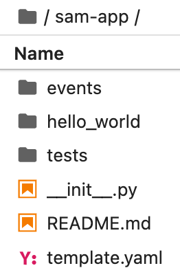

# CLAUDIOLAB

#### Gruppo di studio ITPASS sull'universo del Cloud
___
 *May you have a strong foundation when the winds of changes shift*
<br/> 
Bob Dylan, [**Forever Young**](https://www.youtube.com/watch?v=Frj2CLGldC4)
___

Condivisione di esperienze pratiche nell'utilizzo di soluzioni Cloud.

Abbiamo pensato di partire da **AWS**, *Amazon Web Services*, come primo banco di prova per fare un poco di esperienza. La praticità di accesso ad AWS e la sua diffusione (esiste anche la possibilità di sfruttare 
un primo anno gratuito di sperimentazione) lo rende ideale per partire.

Successivamente potremo estendere le conoscenze ad altre infrastrutture. 
<hr/>

## TESTI INTERESSANTI
Elenchiamo qui di seguito alcuni testi che nel corso del 2021 useremo come riferimento per approfondire l'argomento.

* **Serverless Architectures on AWS** di *Peter Sbarski*. Testo del 2017 in lingua inglese molto centrato sull'argomento (mi è stato segnalato da Roberto G.). Procede diretto verso le funzioni **AWS Lambda** che costituiscono il cuore del concetto *serverless* in ambito AWS.


## INCONTRI REALIZZATI O IN PIANO

* **4 Gennaio 2021 h:21:15** <br/>Primo incontro (virtuale) di avvio del gruppo di studio *ITPASS* sul Cloud (**CLAUDIOLAB**)
<br/>*Prevista la presenza di*: Andrea R., Riccardo P., Roberto G., ...
<br/>Introduzione al tema e indicazioni per utilizzare con profitto l'ambiente *Jupyter Lab* anche per questo progetto. Uso di `samdev`.


## IBM i ?

Non potevamo ignorare un ruolo per la nostra piattaforma di elezione e così abbiamo installato (dopo alcune difficoltà legate a dipendenze non soddisfatte) il tool *open source* di AWS sviluppato in Python e [disponibile su GitHub](https://github.com/aws/aws-sam-cli). 

Nella nostra installazione è richiamabile col nome di `samdev`:   

```
bash-5.0$ samdev --help
Usage: samdev [OPTIONS] COMMAND [ARGS]...

  AWS Serverless Application Model (SAM) CLI

  The AWS Serverless Application Model extends AWS CloudFormation to provide
  a simplified way of defining the Amazon API Gateway APIs, AWS Lambda
  functions, and Amazon DynamoDB tables needed by your serverless
  application. You can find more in-depth guide about the SAM specification
  here: https://github.com/awslabs/serverless-application-model.

Options:
  --debug    Turn on debug logging to print debug message generated by SAM CLI
             and display timestamps.

  --version  Show the version and exit.
  --info
  --help     Show this message and exit.

Commands:
  init      Init an AWS SAM application.
  validate  Validate an AWS SAM template.
  build     Build your Lambda function code
  local     Run your Serverless application locally for quick development &...
  package   Package an AWS SAM application.
  deploy    Deploy an AWS SAM application.
  logs      Fetch logs for a function
  publish   Publish a packaged AWS SAM template to the AWS Serverless
            Application Repository.
```

```
bash-5.0$ samdev init --help

        SAM CLI now collects telemetry to better understand customer needs.

        You can OPT OUT and disable telemetry collection by setting the
        environment variable SAM_CLI_TELEMETRY=0 in your shell.
        Thanks for your help!

        Learn More: https://docs.aws.amazon.com/serverless-application-model/latest/developerguide/serverless-sam-telemetry.html

Usage: samdev init [OPTIONS]

      Initialize a serverless application with a SAM template, folder
      structure for your Lambda functions, connected to an event source such as APIs,
      S3 Buckets or DynamoDB Tables. This application includes everything you need to
      get started with serverless and eventually grow into a production scale application.
      
      This command can initialize a boilerplate serverless app. If you want to create your own
      template as well as use a custom location please take a look at our official documentation.
  
  Common usage:
      
      Starts an interactive prompt process to initialize a new project:
      
      $ sam init
      
      Initializes a new SAM project using project templates without an interactive workflow:
      
      $ sam init --name sam-app --runtime nodejs10.x --dependency-manager npm --app-template hello-world
      
      $ sam init --name sam-app --package-type image --base-image nodejs10.x-base
      
      Initializes a new SAM project using custom template in a Git/Mercurial repository
      
      # gh being expanded to github url
      $ sam init --location gh:aws-samples/cookiecutter-aws-sam-python
      
      $ sam init --location git+ssh://git@github.com/aws-samples/cookiecutter-aws-sam-python.git
      
      $ sam init --location hg+ssh://hg@bitbucket.org/repo/template-name
      
      Initializes a new SAM project using custom template in a Zipfile
      
      $ sam init --location /path/to/template.zip
      
      $ sam init --location https://example.com/path/to/template.zip
      
      Initializes a new SAM project using custom template in a local path
      
      $ sam init --location /path/to/template/folder

Options:
  --config-env TEXT               The environment name specifying the default
                                  parameter values in the configuration file
                                  to use. Its default value is 'default'. For
                                  more information about configuration files,
                                  see: https://docs.aws.amazon.com/serverless-
                                  application-
                                  model/latest/developerguide/serverless-sam-
                                  cli-config.html.

  --config-file TEXT              The path and file name of the configuration
                                  file containing default parameter values to
                                  use. Its default value is 'samconfig.toml'
                                  in project directory. For more information
                                  about configuration files, see:
                                  https://docs.aws.amazon.com/serverless-
                                  application-
                                  model/latest/developerguide/serverless-sam-
                                  cli-config.html.

  --no-interactive                Disable interactive prompting for init
                                  parameters, and fail if any required values
                                  are missing.

  -l, --location TEXT             Template location (git, mercurial, http(s),
                                  zip, path)

  -r, --runtime [python3.6|python2.7|python3.8|dotnetcore3.1|dotnetcore2.1|nodejs10.x|nodejs12.x|java11|go1.x|java8|ruby2.7|python3.7|ruby2.5|java8.al2]
                                  Lambda Runtime of your app
  -p, --package-type [Zip|Image]  Package type for your app
  -i, --base-image [amazon/nodejs12.x-base|amazon/nodejs10.x-base|amazon/python3.8-base|amazon/python3.7-base|amazon/python3.6-base|amazon/python2.7-base|amazon/ruby2.7-base|amazon/ruby2.5-base|amazon/go1.x-base|amazon/java11-base|amazon/java8.al2-base|amazon/java8-base|amazon/dotnetcore3.1-base|amazon/dotnetcore2.1-base]
                                  Lambda Image of your app
  -d, --dependency-manager [gradle|bundler|maven|npm|cli-package|pip|mod]
                                  Dependency manager of your Lambda runtime
  -o, --output-dir PATH           Where to output the initialized app into
  -n, --name TEXT                 Name of your project to be generated as a
                                  folder

  --app-template TEXT             Identifier of the managed application
                                  template you want to use. If not sure, call
                                  'sam init' without options for an
                                  interactive workflow.

  --no-input                      Disable Cookiecutter prompting and accept
                                  default values defined template config

  --extra-context TEXT            Override any custom parameters in the
                                  template's cookiecutter.json configuration
                                  e.g. {"customParam1": "customValue1",
                                  "customParam2":"customValue2"}

  --debug                         Turn on debug logging to print debug message
                                  generated by SAM CLI and display timestamps.

  -h, --help                      Show this message and exit.
```

```
bash-5.0$ samdev init
Which template source would you like to use?
        1 - AWS Quick Start Templates
        2 - Custom Template Location
Choice: 1
What package type would you like to use?
        1 - Zip (artifact is a zip uploaded to S3)      
        2 - Image (artifact is an image uploaded to an ECR image repository)
Package type: 1

Which runtime would you like to use?
        1 - nodejs12.x
        2 - python3.8
        3 - ruby2.7
        4 - go1.x
        5 - java11
        6 - dotnetcore3.1
        7 - nodejs10.x
        8 - python3.7
        9 - python3.6
        10 - python2.7
        11 - ruby2.5
        12 - java8.al2
        13 - java8
        14 - dotnetcore2.1
Runtime: 9

Project name [sam-app]: 

Cloning app templates from https://github.com/aws/aws-sam-cli-app-templates

AWS quick start application templates:
        1 - Hello World Example
        2 - EventBridge Hello World
        3 - EventBridge App from scratch (100+ Event Schemas)
        4 - Step Functions Sample App (Stock Trader)
Template selection: 1

    -----------------------
    Generating application:
    -----------------------
    Name: sam-app
    Runtime: python3.6
    Dependency Manager: pip
    Application Template: hello-world
    Output Directory: .
    
    Next steps can be found in the README file at ./sam-app/README.md
```



[Contenuto del template (formato YAML)](template.yaml)

From [Interpretazione file template.yaml](https://aws.amazon.com/it/blogs/compute/introducing-simplified-serverless-application-deplyoment-and-management/):

<cite>
"The really cool thing about AWS SAM is that you can also use it to create an event source to trigger your Lambda function with just a few lines of text."
</cite>

Nell'esempio di base l'evento è di tipo `Api` 


```
bash-5.0$ samdev deploy --guided

Configuring SAM deploy
======================

        Looking for config file [samconfig.toml] :  Not found

        Setting default arguments for 'sam deploy'
        =========================================
        Stack Name [sam-app]: 
        AWS Region [us-east-1]: eu-south-1
        #Shows you resources changes to be deployed and require a 'Y' to initiate deploy
        Confirm changes before deploy [y/N]: Y
        #SAM needs permission to be able to create roles to connect to the resources in your template
        Allow SAM CLI IAM role creation [Y/n]: 
        HelloWorldFunction may not have authorization defined, Is this okay? [y/N]: Y
        Save arguments to configuration file [Y/n]: 
        SAM configuration file [samconfig.toml]: 
        SAM configuration environment [default]: 
Error: Failed to create managed resources: Unable to locate credentials
```

Installando il file con le credenziali (`$HOME/.aws/credentials`) si determina un nuovo errore:


```
bash-5.0$ samdev deploy --guided

Configuring SAM deploy
======================

        Looking for config file [samconfig.toml] :  Not found

        Setting default arguments for 'sam deploy'
        =========================================
        Stack Name [sam-app]: 
        AWS Region [us-east-1]: eu-south-1
        #Shows you resources changes to be deployed and require a 'Y' to initiate deploy
        Confirm changes before deploy [y/N]: Y
        #SAM needs permission to be able to create roles to connect to the resources in your template
        Allow SAM CLI IAM role creation [Y/n]: 
        HelloWorldFunction may not have authorization defined, Is this okay? [y/N]: Y
        Save arguments to configuration file [Y/n]: Y
        SAM configuration file [samconfig.toml]: 
        SAM configuration environment [default]: 

        Looking for resources needed for deployment: Not found.
        Creating the required resources...
Error: Failed to create managed resources: An error occurred (SignatureDoesNotMatch) when calling the CreateChangeSet operation: Signature not yet current: 20201222T184910Z is still later than 20201222T175457Z (20201222T174957Z + 5 min.)
```

Su internet viene spiegato come: *API services verify timestamps to be within 5 minutes of actual time.* **If the system clock is off by more than 5 minutes, then the API requests will fail.** 

**Per correggere questo errore con** `CHGSYSVAL SYSVAL(QHOUR) VALUE('18')` **anticipo di un ora**

```
Configuring SAM deploy
======================

        Looking for config file [samconfig.toml] :  Not found

        Setting default arguments for 'sam deploy'
        =========================================
        Stack Name [sam-app]: 
        AWS Region [us-east-1]: eu-south-1
        #Shows you resources changes to be deployed and require a 'Y' to initiate deploy
        Confirm changes before deploy [y/N]: Y
        #SAM needs permission to be able to create roles to connect to the resources in your template
        Allow SAM CLI IAM role creation [Y/n]: 
        HelloWorldFunction may not have authorization defined, Is this okay? [y/N]: Y
        Save arguments to configuration file [Y/n]: Y
        SAM configuration file [samconfig.toml]: 
        SAM configuration environment [default]: 

        Looking for resources needed for deployment: Found!

                Managed S3 bucket: aws-sam-cli-managed-default-samclisourcebucket-1h5v0dlmdrcf5
                A different default S3 bucket can be set in samconfig.toml

        Saved arguments to config file
        Running 'sam deploy' for future deployments will use the parameters saved above.
        The above parameters can be changed by modifying samconfig.toml
        Learn more about samconfig.toml syntax at 
        https://docs.aws.amazon.com/serverless-application-model/latest/developerguide/serverless-sam-cli-config.html

Uploading to sam-app/c6ce8fa8b5a97dd022ecd006536eb5a4  847 / 847.0  (100.00%)

        Deploying with following values
        ===============================
        Stack name                   : sam-app
        Region                       : eu-south-1
        Confirm changeset            : True
        Deployment s3 bucket         : aws-sam-cli-managed-default-samclisourcebucket-1h5v0dlmdrcf5
        Capabilities                 : ["CAPABILITY_IAM"]
        Parameter overrides          : {}
        Signing Profiles             : {}

Initiating deployment
=====================
HelloWorldFunction may not have authorization defined.
Uploading to sam-app/387b1bbf62793d2ddb87e7e1e162339a.template  1090 / 1090.0  (100.00%)

Waiting for changeset to be created..

CloudFormation stack changeset
-------------------------------------------------------------------------------------------------
Operation                LogicalResourceId        ResourceType             Replacement            
-------------------------------------------------------------------------------------------------
* Modify                 HelloWorldFunction       AWS::Lambda::Function    False                  
* Modify                 ServerlessRestApi        AWS::ApiGateway::RestA   False                  
                                                  pi                                              
-------------------------------------------------------------------------------------------------

Changeset created successfully. arn:aws:cloudformation:eu-south-1:748723773588:changeSet/samcli-deploy1608660640/84fa3cb6-51c9-4310-831a-035cfd854712


Previewing CloudFormation changeset before deployment
======================================================
Deploy this changeset? [y/N]: 
```
